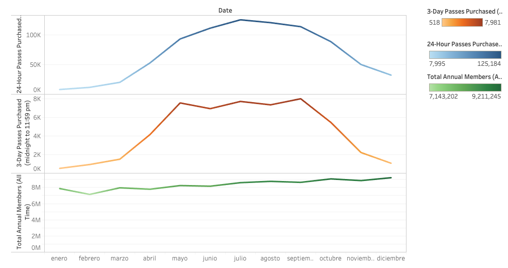
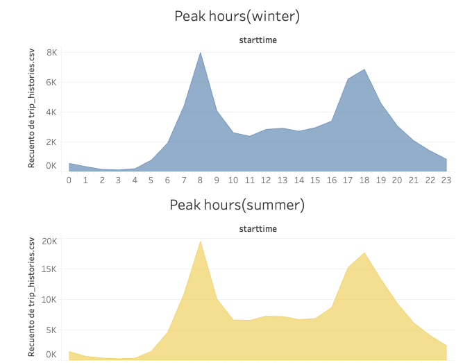
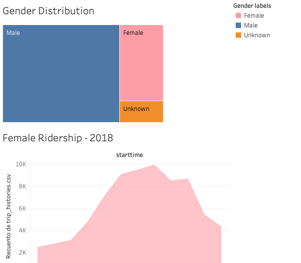

# City Bike Analytics

New York Citi Bike sharing program is the largest bike sharing program in the United States. This system operate in the New York City boroughts of Bronx, Brooklyn, Manhattan and Queens, and also in Jersey City and New Jersey. An analysis of this program was performed taking into account different variables like gender, age, seasons among others. The study focused on the year 2018 and the datasets were obtained from the program system data. Two data sets were used, the first one is about citi bike trip histories and the second one daily ridership and membership. Before the most important results are discussed, there some points about the datasets that were provided and worth mentioning:

* The data has been processed to remove trips that are taken by staff as they service and inspect the system, trips that are taken to/from any of our “test” stations, and any trips that were below 60 seconds in length 
* Trip count and milage estimates include trips with a duration of greater than one minute.
* The data only include trips that begin at publicly available stations (thereby excluding trips that originate at our depots for rebalancing or maintenance purposes).

## Findings

1. Taking about user types. Figure 1 demonstrates that annual members grew along the year, while short term purchases were seasonal. That is, as summer ends, the amount of 3-day and 24 hours passes decrease. The latter situation suggest that the weather conditions, specially the decrease in temperatures, might affect this type of purchases.

2. Peak hours is also another point that must be discussed. Figure 2 demonstrates the presence of two peak hours regardless of the season. The first peak hour is at 8am and the second one is at 6pm. This hours fit with the working hours, that is, the time of entry and exit. This situation shows the popularity of bikes as a way to trasport from one place to another.

3. Figure 3 shows that the majority of Citi Bike users are males(72%). It should be mentioned that around 6% of the people did not identify themselves as male or females, modifying the final result. Despite the latter, this 6% did not change the fact that males users are more active.

4. Taking about the users age, there were two graphs that were made with this variable. The first one is about trip duration. Figure 4 shows that people between 16 and 19 years old, and some people from around their 70s tend to spend more time riding. On the other hand, trip duration from people between 20 and 60 years old is considerably low. The above suggests that certain age groups use bicycles as a form of transportation and other groups use it as a recreational activity.

5. In the case of the user type. It can be said that people that 

The maps that were generated show something that worth saying. As seen in the Figures, most of the trips are made inside the city(Jersey City) and just a few are made from the city to other suburbs like Manhattan.

